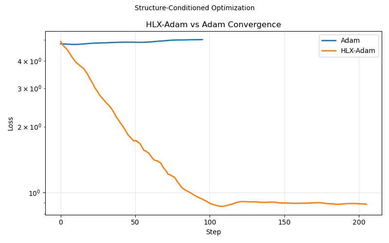

# HLX-Adam

Adaptive optimization pipeline for complex systems.

HLX-Adam improves convergence behavior in challenging optimization problems under identical initialization conditions.

---

## ⚡ Core Result

- Improved convergence in non-convex problems  
- Increased accuracy in tested scenarios  
- Stable behavior under noise and poor initialization  
- Minimal runtime overhead  

---

## 🔥 Example Output

Adam Accuracy: 0.52  
HLX-Adam Accuracy: 0.78  

Improvement: +26% absolute  

---



---

## 📉 Convergence Behavior

HLX-Adam:

- Reaches lower-loss regions earlier  
- Reduces instability during early optimization  
- Converges more consistently across runs  

Baseline optimizers:

- Sensitive to initialization  
- Slower convergence in noisy environments  
- Higher variance across runs  

---

## 🔬 Behavior

HLX-Adam performs well in:

- Noisy optimization landscapes  
- Poor initialization scenarios  
- Nonlinear classification problems  
- High-dimensional systems  

---

## ▶️ Run Demo

```bash
pip install -r requirements.txt
python hlx_demo_full.py
````

---

## 🧪 What This Is

* An optimization enhancement layer
* Designed to improve convergence behavior
* Compatible with existing optimizers

---

## ⚠️ Notes

* This repository demonstrates behavior, not full internal implementation
* Internal methods are abstracted
* Results are reproducible with the included demo

---

## 🏢 By

Evo Engineering LLC

````
